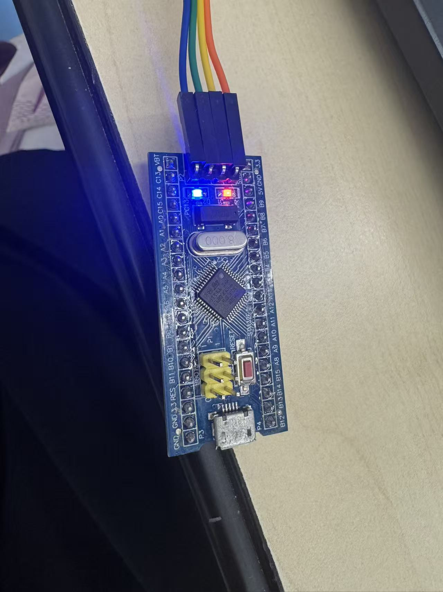
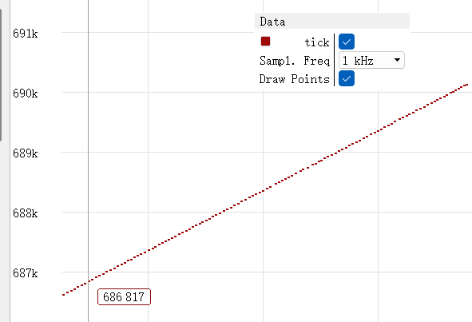
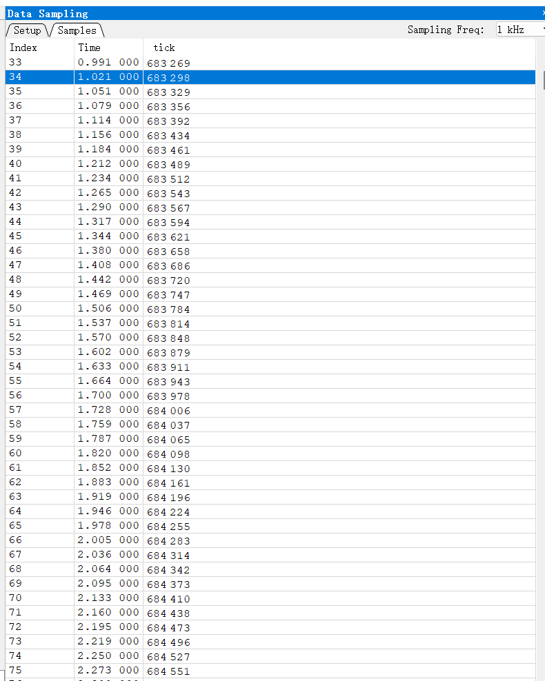
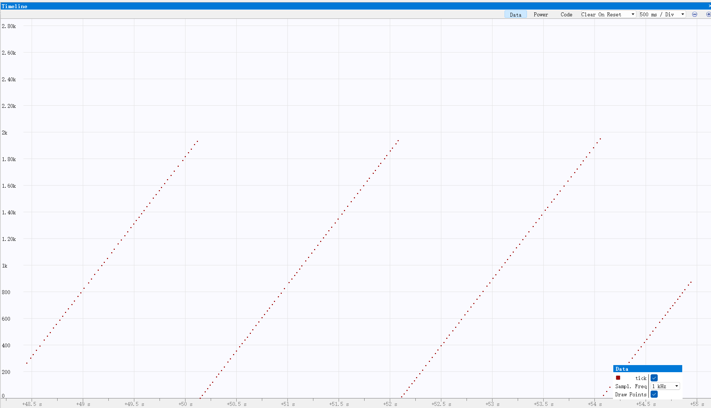

# 电控第一次作业 说明文档

| 项目 | 内容 |
| --- | --- |
| 开发板 | STM32F103C8T6 最小系统板 |
| 芯片型号 | STM32F103C8Tx |
| 系统主频 | 72 MHz |
| 定时器 | TIM2（APB1，1 ms 更新中断） |
| 看门狗 | IWDG，分频 64，Reload 1249，超时约 2 s |
| 构建方式 | STM32CubeMX + CMake / Ninja + VS Code（Debug） |
| 调试器 | DAPLink（CMSIS-DAP）+ SEGGER Ozone V3.26 |

> 三题做在同一个 CubeMX 工程里，业务代码只写在 `Tasks/` 下。

---

## 1. 工程结构

```
first_CMake/
├─ Core/                     # CubeMX 生成，只改 main.c 的 USER CODE 区
│  ├─ Inc/   main.h  stm32f1xx_hal_conf.h  stm32f1xx_it.h
│  └─ Src/   main.c  stm32f1xx_it.c  stm32f1xx_hal_msp.c  system_stm32f1xx.c ...
├─ Drivers/                  # STM32F1 HAL + CMSIS，不修改
├─ cmake/                    # CubeMX 生成的 CMake 配置
├─ Tasks/                    # ★ 业务代码只在这里
│  ├─ inc/main_task.hpp
│  └─ src/main_task.cpp
├─ CMakeLists.txt            # 发放模板，user_folders 保持 "Tasks"
└─ build/                    # 构建输出，含 project.elf
```

- `main.c` 只在 **USER CODE** 区包含头文件并调用 `MainInit()`，`while(1)` 保持为空。
- 全局变量 `tick`、定时器更新回调、GPIO 电平，全部写在 `Tasks/` 里。

---

## 2. 时钟树与定时器时钟来源

CubeMX 时钟树配置（蓝板 8 MHz 晶振）：

```
HSE 8 MHz ──► PLL ×9 ──► SYSCLK = 72 MHz ──► AHB /1 ──► HCLK = 72 MHz
                                              ├─ APB1 /2 ──► PCLK1 = 36 MHz
                                              │             └─ APB1 Timer clocks = 72 MHz ← TIM2 用这个
                                              └─ APB2 /1 ──► PCLK2 = 72 MHz
```

**关键点**：TIM2 挂在 **APB1** 上；当 APB1 的分频系数 **不为 1** 时，送到定时器的时钟是 APB1 的 **2 倍**，即

$$
f_{\text{TIM2}} = 2 \times 36\ \text{MHz} = 72\ \text{MHz}
$$

这个 72 MHz 就是后面计算 PSC、ARR 所用的定时器时钟（以 CubeMX 时钟树显示的 `APB1 Timer clocks` 为准）。

---

## 3. 第 1 题：GPIO

- 在 CubeMX 里把 **PC13** 配置为 **推挽输出（Output Push Pull）**；
- F103 蓝板板载 LED 接在 PC13，**低电平点亮**；
- 在 Tasks 的初始化 `MainInit()` 里把它写成**低电平**（不在 `while(1)` 里翻转）：

```cpp
void MainInit(void)
{
  /* 低电平点亮板载 LED */
  HAL_GPIO_WritePin(GPIOC, GPIO_PIN_13, GPIO_PIN_RESET);
  ...
}
```

**现象**：板载 LED 常亮（见附录 图 1）。

---

## 4. 第 2 题：定时器 1 ms 更新中断与 tick

### 4.1 PSC / ARR 计算过程

TIM2 的更新中断周期：

$$
T_{\text{up}} = \frac{(PSC+1)\times(ARR+1)}{f_{\text{TIM2}}}
$$

要求 $T_{\text{up}} = 1\ \text{ms}$，$f_{\text{TIM2}} = 72\ \text{MHz}$，则：

$$
(PSC+1)(ARR+1) = f_{\text{TIM2}} \times T_{\text{up}}
= 72\,000\,000 \times 0.001 = 72000
$$

取整数分频 $PSC+1 = 72$，则：

$$
PSC = 71,\qquad ARR+1 = \frac{72000}{72} = 1000 \;\Rightarrow\; ARR = 999
$$

即 **PSC = 71，ARR = 999**，代入验算：

$$
T_{\text{up}} = \frac{72 \times 1000}{72\,000\,000} = \frac{1}{1000}\ \text{s} = 1\ \text{ms}
$$

CubeMX 中设置：`TIM2 → Prescaler = 71`、`Counter Period = 999`，并在 NVIC 里使能 **TIM2 global interrupt**。

### 4.2 全局 tick

按题目要求，变量名必须叫 `tick`，类型为 **全局 `volatile uint32_t`**：

```cpp
/* Tasks/src/main_task.cpp */
extern "C" {
volatile uint32_t tick = 0;
}
```

`volatile` 防止编译器把自增优化掉；用 `extern "C"` 保证导出符号名就是 `tick`，Ozone 里可以直接按名字监视。

### 4.3 Tasks 里的定时器更新回调（全工程只写这一份）

```cpp
extern "C" void HAL_TIM_PeriodElapsedCallback(TIM_HandleTypeDef *htim)
{
  if (htim->Instance == TIM2) {
    tick = tick + 1;              /* 每 1 ms 加 1 → 约 1000/s */

    /* 第 2 题：喂狗（第 3 题时注释掉） */
    HAL_IWDG_Refresh(&hiwdg);
  }
}
```

> - 用 C++ 写回调必须加 **`extern "C"`**，否则覆盖不了 HAL 的弱符号；
> - 回调只保留这一份；若 CubeMX 在别处也生成了同名函数要删掉，否则重复定义；
> - **没有**用 `HAL_Delay` 或空循环去加 tick。

### 4.4 启动定时器

```cpp
void MainInit(void)
{
  HAL_GPIO_WritePin(GPIOC, GPIO_PIN_13, GPIO_PIN_RESET);
  HAL_TIM_Base_Start_IT(&htim2);   /* 启动 1ms 更新中断 */
}
```

**现象**：Ozone 运行态下，`tick` 每秒约增加 1000（见附录 图 2）。

---

## 5. 第 3 题：看门狗 IWDG

### 5.1 超时计算

IWDG 由 **LSI**（内部低速时钟）驱动，F103 的 LSI 约 **40 kHz**。超时时间：

$$
T_{\text{out}} = \frac{(Reload+1)\times \text{分频系数}}{f_{\text{LSI}}}
$$

取分频系数 = 64、Reload = 1249：

$$
T_{\text{out}} = \frac{(1249+1)\times 64}{40\,000}
= \frac{80\,000}{40\,000} = 2.0\ \text{s}
$$

CubeMX 设置：`Prescaler = IWDG_PRESCALER_64`，`Reload = 1249`，超时约 **2 s**。

### 5.2 现象与验证

- 第 2 题中，回调每 1 ms 调用一次 `HAL_IWDG_Refresh(&hiwdg)` 喂狗，`tick` 持续增长；
- 第 3 题 **去掉回调里的 `HAL_IWDG_Refresh`**，重新编译下载后：
  - 芯片约 2 s 得不到喂狗 → IWDG 溢出 → **MCU 复位**；
  - 复位后启动代码把全局变量清零，所以 **`tick` 从 0 涨到约 2000，然后回到 0，不断重复**；
- 用 Ozone 观察时让程序 **运行**、不要停在断点上（CPU 停住时看门狗仍在计数，会掉线）。

**现象**：`tick` 呈锯齿状，涨到约 2000 后归零、循环（见附录 图 3）。

---

## 6. 三题与配置小结

| 题 | 外设/变量 | 配置 | 现象 |
| --- | --- | --- | --- |
| 1 GPIO | PC13 | 推挽输出，写低电平 | 板载 LED 常亮 |
| 2 定时器 | TIM2 | PSC=71, ARR=999 → 1 ms；回调 `tick++` + 喂狗 | tick 约 1000/s |
| 3 看门狗 | IWDG | 分频 64, Reload 1249 → 2 s；回调去掉喂狗 | tick 涨到约 2000 后归零 |

---

## 7. 附录（图）

> 说明文档只在附录放图。

### 图 1（GPIO）：板载 LED 点亮



### 图 2（定时器）：tick 约每秒增加 1000





### 图 3（看门狗）：tick 涨到约 2000 后归零


